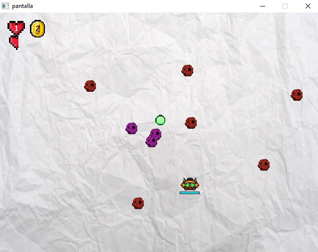
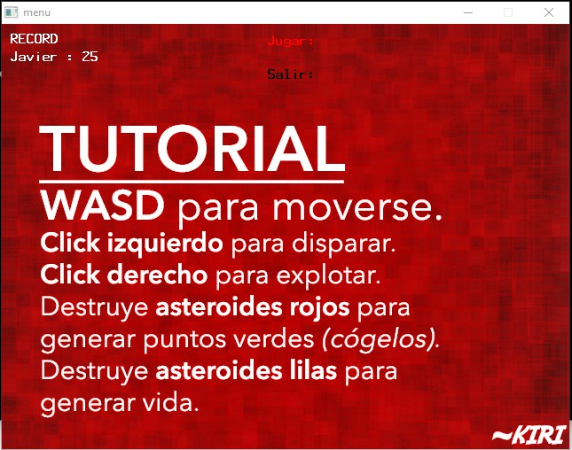
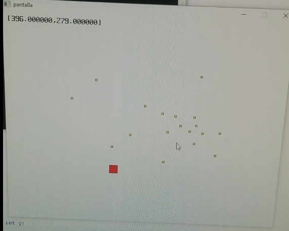

# Paper Blob

SDL (_Simple DirectMedia Layer_) is a cross-platform development library designed to provide low level access to audio, keyboard, mouse, joystick, and graphics hardware via OpenGL and Direct3D.It can be used to make animations and video games.

- It basically provides a set of APIs to interact with various devices like graphics hardware, audio, keyboard, mouse, etc.
- It is written in C programming language and works with C++ and various other languages like c# and python.

## Implementation
This library has been using through C programming language.

* `main.c` is the choreographer of the scene.
* Point DTO class `Punto.c`
* Main character, a **Ship**, is implemented in `Nave.c`
* Home made `linked list` structure with pointers in `Lista.c`. A linked list is a way to store a collection of elements. Like an array these can be character or integers. Each element in a linked list is stored in the form of a node. 
    ```
    struct LinkedList { 
        int data; 
        struct LinkedList *next;
    };
    ```
* Score system in `Fichero.c` stored in a file `score`.

## Execution
**Windows** .exe binaries are in `bin/juego.exe`

## Screenshots
### Main game image:


### Menu with tutorial:


### MVP game sketch:

